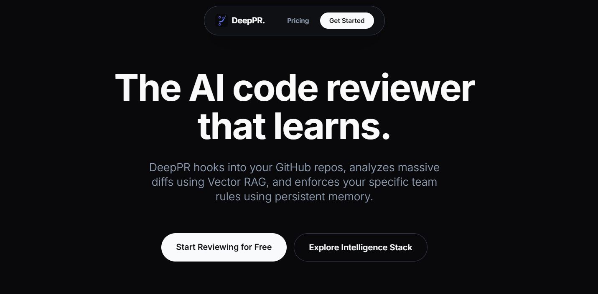

 

  

  <h3 align="center">DeepPR</h3>

  

    <strong>A Serverless, Multi-Agent AI Code Reviewer with Vector RAG & Persistent Memory</strong>
     
     
    <a href="https://github.com/priyanshubh/DeepPR">View Code</a>
    ·
    <a href="https://github.com/priyanshubh/DeepPR/issues">Report Bug</a>
    ·
    <a href="https://github.com/priyanshubh/DeepPR/issues">Request Feature</a>
  

  
  
  
  
  
  

 

Table of Contents

<ol>
<li><a href="#-about-the-project">About The Project</a></li>
<li><a href="#-key-features">Key Features</a></li>
<li><a href="#-tech-stack">Tech Stack</a></li>
<li><a href="#-architecture--folder-structure">Architecture & Folder Structure</a></li>
<li><a href="#-getting-started">Getting Started</a></li>
<li><a href="#-contributing">Contributing</a></li>
</ol>

---

## 🤖 About The Project

**DeepPR** is an advanced, automated GitHub Pull Request reviewer. It acts as an autonomous engineering teammate that hooks directly into your repository webhooks.

Unlike basic AI wrappers, DeepPR leverages **Pinecone Vector RAG** to chunk and analyze massive PRs without hitting token limits, and utilizes **mem0 Persistent Memory** to learn your specific team's coding conventions over time. Built on a serverless **AWS architecture**, it provides enterprise-grade scalability with a zero-cost "Bring Your Own Key" (Custom Instructions) model.

---

## 🔥 Key Features

- **⚡ Serverless Webhook Pipeline**
  Powered by AWS Lambda & API Gateway. Instantly intercepts GitHub PR events and processes reviews in the background using FastAPI.
- **🌌 Vector DB RAG (Pinecone)**
  Automatically chunks massive 20,000+ line pull requests, embeds them, and uses semantic search to feed only the most critical logic to the AI.
- **🧠 Persistent Memory (mem0)**
  Cures LLM amnesia. DeepPR extracts patterns from every review and permanently remembers past bugs, team preferences, and style guidelines across your entire repository.
- **🎯 Multi-Model Engine**
  Seamlessly switch between **Amazon Bedrock (Claude 3)** and **Google Gemini 1.5 Flash** using the Custom Instructions dashboard.
- **💎 Automated Inline Comments**
  DeepPR doesn't just leave a generic summary; it posts precise, inline comments directly on the exact lines of code that need fixing on GitHub.
- **🔒 Beautiful SaaS Dashboard**
  A sleek, Mobbin-inspired dark mode frontend built in Next.js for managing your API keys, configuring custom team rules, and viewing recent AI reviews.

---

## ⚙️ Tech Stack

| Category                 | Technology               | Description                                                                     |
| ------------------------ | ------------------------ | ------------------------------------------------------------------------------- |
| **Frontend**             | **Next.js 14**           | Modern React App Router architecture with Tailwind CSS.                         |
| **Backend**              | **FastAPI (Python)**     | High-performance Python API handling GitHub webhook signatures.                 |
| **Cloud Infrastructure** | **AWS SAM (Serverless)** | Deployed via AWS Lambda and API Gateway for zero idle costs.                    |
| **Database & Memory**    | **DynamoDB & Pinecone**  | DynamoDB for NoSQL review tracking, Pinecone for RAG vector storage.            |
| **AI Orchestration**     | **LangChain & mem0**     | Advanced prompt engineering, structured Pydantic outputs, and long-term memory. |

---

## 📂 Architecture & Folder Structure

`	ext
DeepPR/
├── frontend/             # Next.js Dashboard Application
│   ├── src/app/          # App Router Pages (Dashboard, Pricing, etc.)
│   └── src/components/   # Reusable UI Components
├── backend/              # FastAPI Serverless Backend
│   ├── app/core/         # GitHub Client & Diff Parsers
│   ├── app/engine/       # LangChain Reviewer, RAG Pipeline, mem0
│   └── app/api/v1/       # Webhook Endpoints
├── template.yaml         # AWS SAM CloudFormation Template
├── SaaS_ARCHITECTURE_FLOW.md  # Detailed SaaS Custom Instructions Architecture logic
└── FUTURE_ROADMAP.md     # Planned Multi-Agent Features
`

---

## 🧰 Getting Started

### Prerequisites

- **Node.js** (v18+)
- **Python** (3.10+)
- **AWS CLI & AWS SAM**
- **Pinecone** API Key

### Installation

1. **Clone the repository**
   `ash
git clone https://github.com/priyanshubh/DeepPR.git
cd DeepPR
`

2. **Backend Setup**
   `ash
cd backend
python -m venv venv
venv\Scripts\activate
pip install -r requirements.txt
`

3. **Environment Setup**
   Create a .env in the ackend/ folder:
   `env
DEFAULT_LLM_PROVIDER=gemini
GEMINI_API_KEY=your_gemini_key
GITHUB_TOKEN=your_github_pat
PINECONE_API_KEY=your_pinecone_key
PINECONE_INDEX_NAME=deeppr
`

4. **Frontend Setup**
   `ash
cd ../frontend
npm install
npm run dev
`

---

## 🚀 Follow Me

  
  
  

 

Built with ❤️ by <a href="https://github.com/priyanshubh">Priyanshu Bharti</a>

